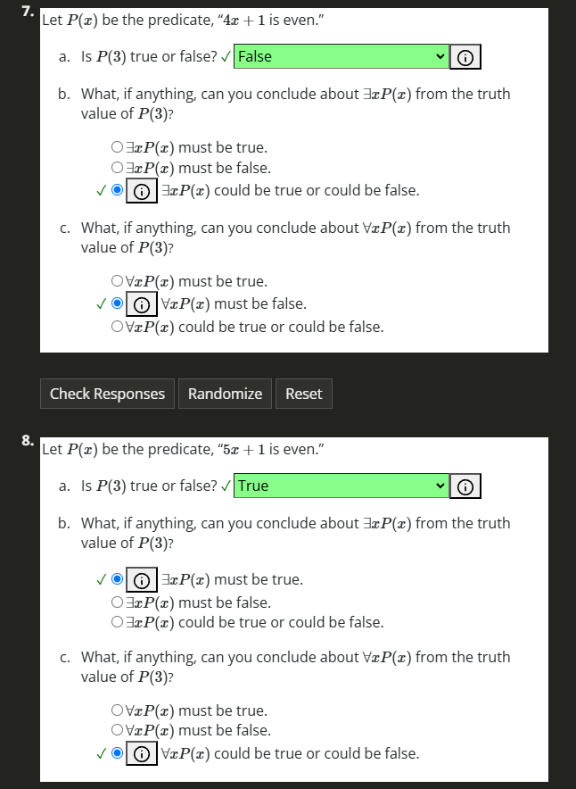

# Addition Exercises Chapter 1

## Reading Questions
1. Match each statement in symbols with its type of statement.
P and Q (conjunction) $P \land Q$

If P, then Q (implication) $P => Q$

P or Q (disjuction) $P \lor Q$

Not P (negation) $\neg P$

2. Consider the sentence, “If $x > 3$, then $x$ is even." Which of the following statements are true about the sentence? Select all that apply.🔗

B. The universal generalization of the sentence is a statement.
C. If you substitute $10$ for $x$, the resulting statement is true.

## Practice Problems

## Additional Exercises

### 1. Suppose P and Q are the statements:  
- $P$ Jack passed math.  
- $Q$ Jill passed math.  

(a) Translate "Jack and Jill both passed math" into symbols.  

> $P \land Q$

(b) Translate "If Jack passed math, then Jill did not" into symbols.  

> $P \rightarrow \neg Q$

(c) Translate " $P \lor Q$ " into English.  

> Jack or Jill passed math.

(d) Translate " $\neg (P \land Q) \rightarrow Q$ " into English.  

> "If Jack and Jill did not both pass math, then Jill passed math."

(e) Suppose you know that if Jack passed math, then so did Jill. What can you conclude if you know that:  

i. Jill passed math?  

> We can only conclude that Jill passed math, Jill passing math does not mean Jack passed.

ii. Jill did not pass math?  

> The only way $P => Q$ can remain true if $Q$ is false is for $P$ to be false, therefore Jack failed.

### 2. Translate into symbols. Use $E(x)$ for "$x$ is even" and $O(x)$ for "$x$ is odd."

(a) No number is both even and odd.

> $\neg \forall x (E(x) \land O(x))$

(b) One more than any even number is an odd number.

> $\forall x (E(x) \rightarrow O(x+1))$

(c) There is a prime number that is even.

> $\exists x (P(x) \land E(x))$

(d) Between any two numbers there is a third number.

> $\forall x \forall y (x < y \rightarrow \exists z (x < z < y))$

(e) There is no number between a number and one more than that number.

> $\forall x \neg \exists y (x < y < x+1)$

### 3. 
