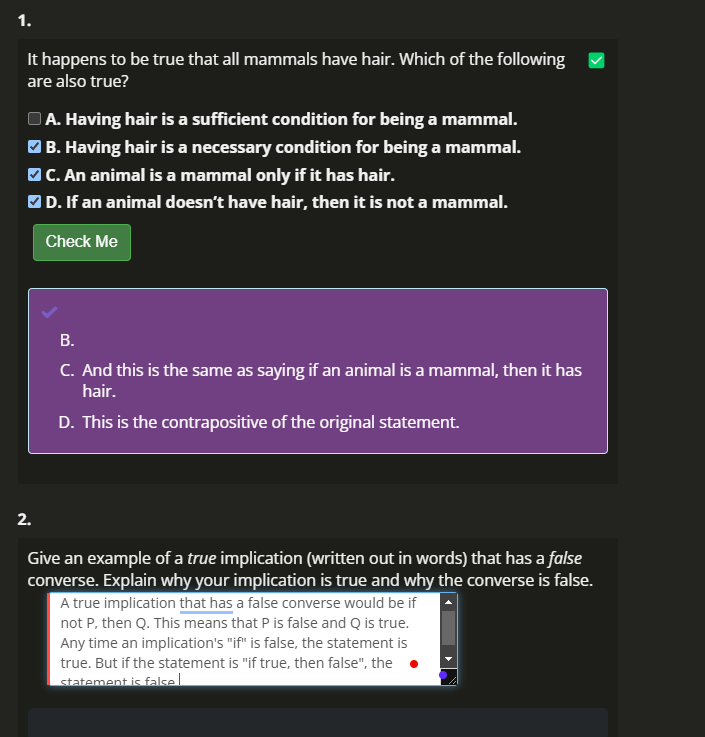
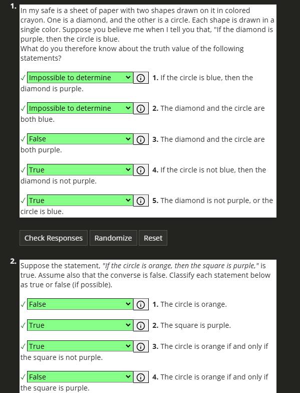
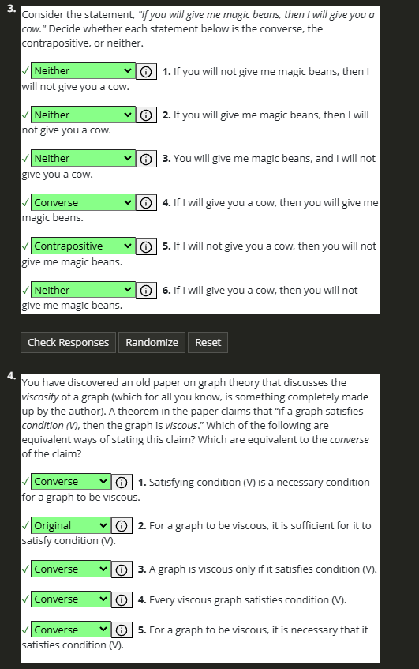
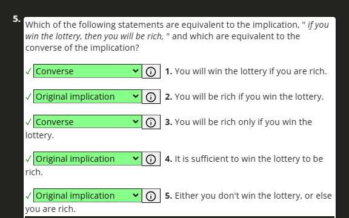

# Additional Exercises Chapter 1 Section 2

## Reading Questions

## Practice Problems

## Additional Exercises

1. Translate into English:

(a) $\forall x (E(x) \imp E(x +2))$

> For all values of $x$, if $x$ is even, then $x + 2$ is  even.

(b) $\forall x \exists y (\sin(x) = y)$

> For all values of $x$, there is some $y$ value that equals the sine of $x$

(c) $\forall y \exists x (\sin(x) = y)$

> For all values of y, there is some sine of x that equals y. 

(d) $\forall x \forall y (x^3 = y^3 \imp x = y)$

> For all values of $x$ and $y$, if $x^3 = y^3$, then $x = y$.

2. Consider the statement, “If Oscar eats Chinese food, then he drinks milk.”

(a) Write the converse of the statement.

> If Oscar drinks milk, then he eats Chinese food.

(b) Write the contrapositive of the statement.

> If Oscar does not drink milk, then he does not eat Chinese food.

(c) Is it possible for the contrapositive to be false? If it was, what would that tell you?

> Contrapositives of true statements are always true. Thus, the original statement would need to be false as well for it to be true.

(d) Suppose the original statement is true, and that Oscar drinks milk. Can you conclude anything (about his eating Chinese food)? Explain.

> This doesn't necessarily imply he eats Chinese food. For example, if you take the converse of the statement, and say that he drinks milk but does not eat Chinese food, and the converse statement would be: "If Oscar drinks milk, then he eats Chinese food". It is a false implication if he doesn't eat Chinese food.

(e) Suppose the original statement is true, and that Oscar does not drink milk. Can you conclude anything (about his eating Chinese food)? Explain.

> If the original statement is true, and Oscar does not drink milk, then he cannot have eaten Chinese food, as if he did, the only way for the statement to be true would be if he had drank milk.

3. Write each of the following statements in the form, “If …, then ….” Careful, some statements may be false (which is fine for the purposes of this question).

(a) To lose weight, you must exercise.

> If you lose weight, then you must have exercised.

(b) To lose weight, all you need to do is exercise.

> If you exercise, then you will lose weight.

(c) Every American is patriotic.

> If a person is American, then they are patriotic.

(d) You are patriotic only if you are American.

> If you are patriotic, then you are American.

(e) The set of rational numbers is a subset of the real numbers.

> If a number is rational, then it is a real number.

(f) A number is prime if it is not even.

> If a number is not even, then it is prime.

(g) Either the Broncos will win the Super Bowl, or they won’t play in the Super Bowl.

> If the Broncos do not win the Super Bowl, then they won't play in the Super Bowl.

4. Consider the implication, “If you clean your room, then you can watch TV.” Rephrase the implication in as many ways as possible. Then do the same for the converse.

Implication:
- If you clean your room, then you are allowed to watch TV.
- You can watch TV only if you clean your room.
- If you cannot watch TV, then you did not clean your room.
- Cleaning your room is required to watch TV.

Converse:
- If you can watch TV, then that means you have cleaned your room.
- You cleaned your room only if you can watch TV.
- If you did not clean your room, then you cannot watch TV.
- If you can watch TV, it must be because you cleaned your room.

5. Recall from calculus, if a function is differentiable at a point $c$, then it is continuous at $c$, but that the converse of this statement is not true (for example, $f(x) = |x|$ at the point $0$). Restate this fact using “necessary and sufficient” language.

> Differentiability at a point $c$ is sufficient for continuity at $c$, but continuity at $c$ is not a necessary condition for differentiability at $c$. 

6. Consider the statement, “For all natural numbers $n$, if $n$ is prime, then $n$ is solitary.” You do not need to know what solitary means for this problem, just that it is a property that some numbers have and others do not.

(a) Write the converse and the contrapositive of the statement, saying which is which. Note: the original statement claims that an implication is true for all $n$, and it is that implication that we are taking the converse and contrapositive of.

Converse:

> For all natural numbers $n$, if $n$ is solitary, then $n$ is prime.

Contrapositive:

> For all natural numbers $n$, if $n$ is not solitary, then $n$ is not prime.

(b) Write the negation of the original statement. What would you need to show to prove that the statement is false?

> If there exists a natural number $n$ such that $n$ is prime and $n$ is not solitary.

(c) Even though you don’t know whether 10 is solitary (in fact, nobody knows this), is the statement, “If 10 is prime, then 10 is solitary” true or false? Explain.

> The statement is true because the "if"/hypothesis is false (10 isn't prime), and since it is an implication, the statement is true.

(d) It turns out that 8 is solitary. Does this tell you anything about the truth or falsity of the original statement, its converse or its contrapositive? Explain.

> It doesn't tell us anything about the original statement. However, it does make the converse false as 8 is solitary, but not prime. 

(e) Assuming that the original statement is true, what can you say about the relationship between the set $P$ of prime numbers and the set $S$ of solitary numbers. Explain.

> Every prime number must be solitary. The original statement says that if a number is prime, then the number is solitary. This is an implication, and implications are true when the hypothesis and the conclusion are both correct, or when the hypothesis is false. Thus, if a number is not prime, then it doesn't need to be solitary for the statement to be true. If it is prime, then it must be solitary for the statement to be true. Thus, if the statement is true, then every prime number is solitary.