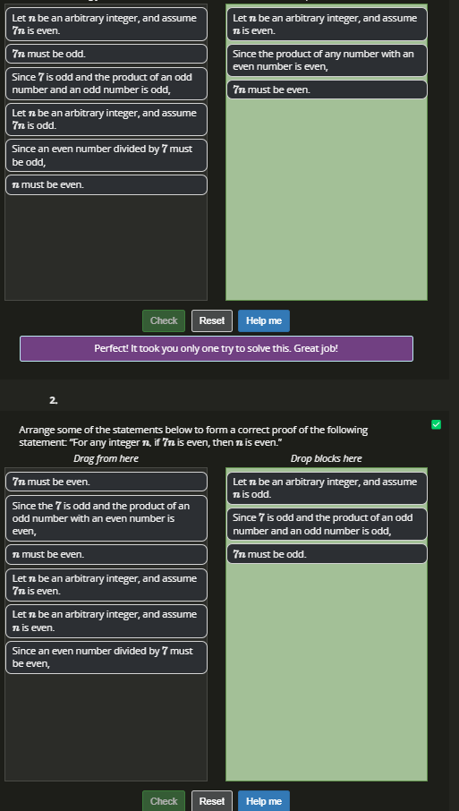
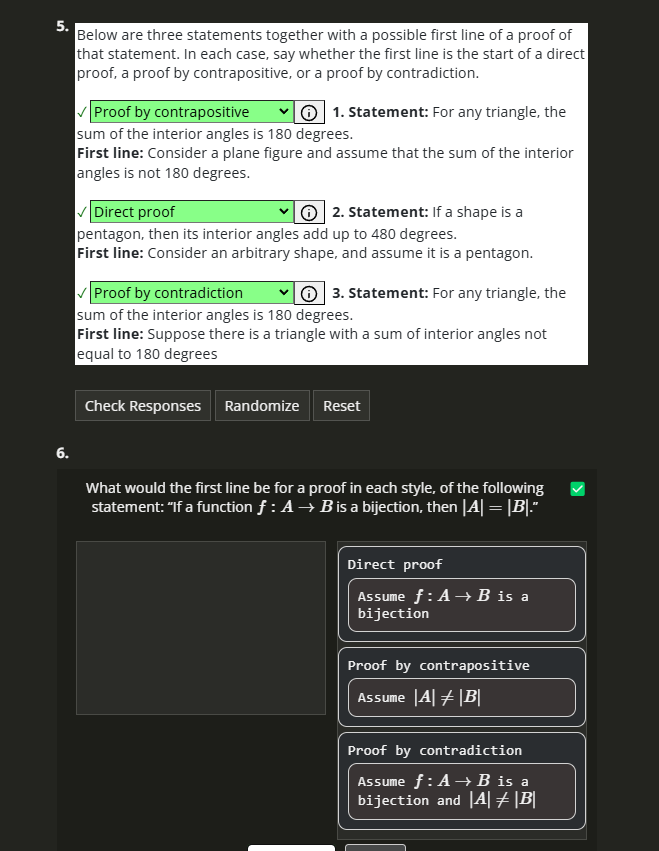

# Additional Exercises Chapter 1 Section 4

## Practice Problems

## Additional Exercises

1. For a given predicate $P(x)$, you might believe that the statements $\forall x P(x)$ or $\exists x P(x)$ are either true or false. How would you decide if you were correct in each case? You have four choices: You could give an example of an element $n$ in the domain for which $P(n)$ is true or for which $P(n)$ is false, or you could argue that no matter what $n$ is, $P(n)$ is true or is false.

(a) What would you need to do to prove $\forall x P(X)$ is true?

> You need to prove that $P(x)$ is true for every possible $x$ value in the domain (since it is $\forall x$). Meaning, for every $x$ value in the domain, $P(x)$ remains true.

(b) What would you need to do to prove $\forall x P(x)$ is false?

> You just need to find one counterexample of $x$ in the domain that you can put into $P(x)$. Since it is $\forall x$, just finding one counter example would mean it is not always true.

(c) What would you need to do to prove $\exists x P(x)$ is true?

> You need to find at least one example where $P(n)$ is true for some $x$ in the domain.

(d) What would you need to do to prove $\exists x P(x)$ is false?

> Since it is $\exists x$, it is true if there is at least one $x$ value in the domain that results in $P(x)$ being true. Therefore, you must prove that there are no $x$ values in the domain that result in $P(x)$ being true.
